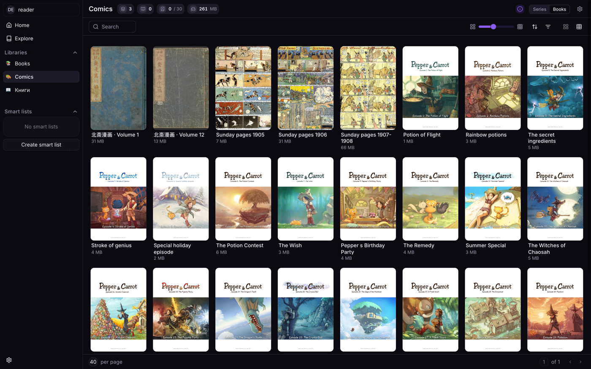

<p align="center">
  
  <br />
  <a href="https://github.com/vint1024/NoirPanther/releases">
    
  </a>
  <a href="https://github.com/vint1024/NoirPanther/pkgs/container/noirpanther">
    
  </a>
  <a href="./LICENSE">
    
  </a>
</p>

<p align="center">

**NoirPanther server** is a self-hosted comics, manga and e-book server — a friendly fork of
[Stump](https://github.com/stumpapp/stump) with a different look, full Russian localization and a
handful of features on top. Everything Stump does, it does.

</p>

<p align="center">

</p>

<details>
  <summary><b>Table of Contents</b></summary>
  <p>

- [Install with Docker Compose](#install-with-docker-compose)
- [What this fork adds](#what-this-fork-adds)
- [Inherited from Stump](#inherited-from-stump)
- [Versioning and updates](#versioning-and-updates)
- [Clients](#clients)
- [Disclaimer](#disclaimer)
- [License](#license)
- [Attribution](#attribution)
</details>

## Install with Docker Compose

Multi-arch images (`linux/amd64`, `linux/arm64`) are published to the GitHub Container
Registry — no login required:

| Tag                                     | What you get                                                    |
| --------------------------------------- | --------------------------------------------------------------- |
| `ghcr.io/vint1024/noirpanther:latest`   | the newest release                                              |
| `ghcr.io/vint1024/noirpanther:0.1.9`    | the newest fork revision built on Stump 0.1.9                   |
| `ghcr.io/vint1024/noirpanther:0.1.9-r3` | exactly this release (pinned — updates only when you change it) |

### With the built-in SQLite database

The simplest setup — one container, the database is a file in the config folder.

```yaml
# docker-compose.yml
services:
  noirpanther:
    image: ghcr.io/vint1024/noirpanther:latest
    container_name: noirpanther
    volumes:
      - ./noirpanther_config:/config # database, thumbnails, avatars, logs
      - /path/to/your/books:/data
    ports:
      - 10801:10801
    environment:
      - PUID=1000
      - PGID=1000
      - TZ=UTC
      - STUMP_CONFIG_DIR=/config
    restart: unless-stopped
```

### With PostgreSQL

Recommended for large libraries (tens of thousands of books) and several simultaneous users.
Put the database password into a `.env` file next to the compose file
(`STUMP_DB_PASSWORD=choose-a-password`).

```yaml
# docker-compose.yml
services:
  db:
    image: postgres:18-alpine
    container_name: noirpanther-db
    environment:
      POSTGRES_USER: stump
      POSTGRES_PASSWORD: ${STUMP_DB_PASSWORD}
      POSTGRES_DB: stump
    volumes:
      - pgdata:/var/lib/postgresql
    healthcheck:
      test: ['CMD-SHELL', 'pg_isready -U stump -d stump']
      interval: 5s
      timeout: 3s
      retries: 30
    restart: unless-stopped

  noirpanther:
    image: ghcr.io/vint1024/noirpanther:latest
    container_name: noirpanther
    depends_on:
      db:
        condition: service_healthy
    volumes:
      - ./noirpanther_config:/config # thumbnails, avatars, logs (the database lives in `db`)
      - /path/to/your/books:/data
    ports:
      - 10801:10801
    environment:
      - PUID=1000
      - PGID=1000
      - TZ=UTC
      - STUMP_CONFIG_DIR=/config
      - STUMP_DB_HOST=db
      - STUMP_DB_PORT=5432
      - STUMP_DB_NAME=stump
      - STUMP_DB_USER=stump
      - STUMP_DB_PASSWORD=${STUMP_DB_PASSWORD}
    restart: unless-stopped

volumes:
  pgdata:
```

### Run it

```bash
docker compose up -d
```

Open `http://<host>:10801` — the first account you create becomes the server owner. Then add a
library pointing at `/data`.

Updating:

```bash
docker compose pull && docker compose up -d
```

- Both files live in [`docker/examples`](docker/examples): [`docker-compose.yml`](docker/examples/docker-compose.yml),
  [`docker-compose.postgres.yml`](docker/examples/docker-compose.postgres.yml), plus
  [`backup-postgres.sh`](docker/examples/backup-postgres.sh) for database dumps.
- Moving an existing SQLite database to PostgreSQL: start the PostgreSQL stack once (it creates the
  schema), stop the server container, run [`scripts/db/sqlite_to_postgres.py`](scripts/db/sqlite_to_postgres.py),
  start it again.
- Any Stump client works with the server (OPDS, KOReader, Kobo and the Stump apps included); the
  NoirPanther app adds the fork-only features on top and keeps a compatibility mode for vanilla Stump servers.

## What this fork adds

- **A different look** — panther branding and six themes (_Vibranium_ by default, plus light
  variants); the Stump themes are still there
- **Full Russian localization** of the web app, alongside the upstream languages
- **Installable as a home-screen app (PWA)** — proper manifest and icons, a "remember me" login,
  search on the home screen, and lists that return to where you left them
- **Multiple folders per library**, so one library can span several paths
- **Reversible series merging** — fold scattered folders into one series and undo it later
- **Content access rules** — hide books and series from a user by tag, genre or publisher
- **Read-only users can read EPUBs** — streamed page by page, no download permission needed, with
  an encrypted offline mode for the mobile app
- **Metadata written back into EPUB files** (opt-in), with an editor in the web app
- **Better metadata out of files** — clean titles from multi-title EPUBs, real series from EPUB 3
  collections, comic languages, and manga that opens right-to-left by itself
- **Book clubs** — enabled and built to work with large clubs
- **PostgreSQL-ready** — the upstream queries that only worked on SQLite are fixed, and there is a
  script to move an existing SQLite database over
- **Search that finds things** — case-insensitive in any language, and it matches authors too

## Inherited from Stump

Everything [Stump](https://github.com/stumpapp/stump) offers is here — see its
[README](https://github.com/stumpapp/stump#features) and [documentation](https://www.stumpapp.dev)
for the details:

- OPDS v1.2 (incl. PSE) and v2.0
- EPUB, PDF, CBZ/ZIP and CBR/RAR, with built-in readers for each
- Annotations and highlights in EPUB books
- Multi-user accounts with permissions and age restrictions
- OIDC authentication
- Kobo and KOReader sync
- Smart lists, reading progress and statistics

## Versioning and updates

Releases are numbered **`<Stump version>-r<N>`**: `0.1.9-r3` is built from Stump `0.1.9`, and `r3`
is the third fork revision on top of it. So the first half tells you which Stump you are getting.

The server checks this repository's releases and tells the owner in **Settings → Server → General**
when a newer one exists.

> **Upgrading from `0.1.7` or older:** Stump 0.1.8 removed the `profile` setting and no longer
> accepts settings it does not know, so delete the `profile = "…"` line from your `Stump.toml`
> first. The server rewrites the file on the next start, so it is a one-time edit.

## Clients

The web app is built in — open the server in a browser, or install it to the home screen.

Any Stump-compatible client works: OPDS readers, KOReader, Kobo, and the Stump mobile apps.
There is also **NoirPanther**, a separate iOS / Android / macOS client built for this server, which
adds the fork-only features (encrypted offline reading, book clubs, series merging) and keeps a
compatibility mode for vanilla Stump servers.

## Disclaimer

This is a personal fork, kept in step with upstream Stump and used to run the author's own servers.
Like Stump itself, treat it as **beta software** until a stable `1.0`: no guarantees, and no
timeline for features or fixes. Back up your database before upgrading.

## License

> If a package or subfolder has its own license file, that license takes precedence over the repository-level license and will be listed below.

- The [expo application](./apps/expo/LICENSE) is licensed under [GPL-3.0](./apps/expo/LICENSE) ([summary](https://www.gnu.org/licenses/gpl-3.0.html))
- The [`wifi-ssid` native module](./apps/expo/modules/wifi-ssid) was sourced from Streamyfin and licensed under [MPL-2.0](https://www.mozilla.org/en-US/MPL/2.0/) ([summary](https://www.tldrlegal.com/license/mozilla-public-license-2-0-mpl-2))
- All other code in the repository is licensed under [MIT License](./LICENSE) ([summary](https://www.tldrlegal.com/license/mit-license))

## Attribution

- Some of the icons used in the web and mobile applications are from the [Spacedrive](https://github.com/spacedriveapp/spacedrive/tree/main/packages/assets/icons) repository, and are licensed under the [FSL-1.1-ALv2](https://github.com/spacedriveapp/spacedrive/blob/main/LICENSE) license.
- The native Readium expo modules were adapted from [Storyteller](https://gitlab.com/storyteller-platform/storyteller)
